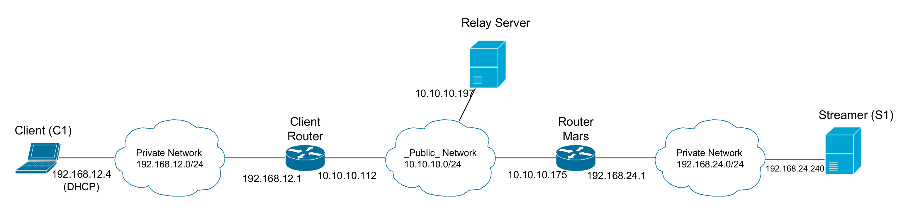
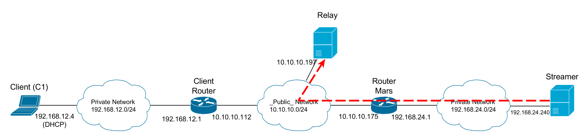
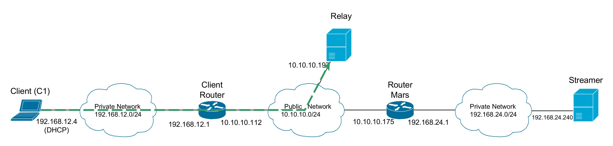
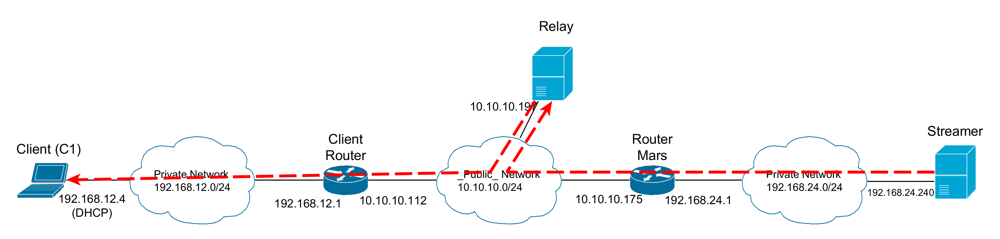

# NAT Punching



C1 would like to watch a video being streamed by S1 using the MP4Box software, unicast RTP/UDP stream. Since, both the streamer and the client are behind a NAT router, they can't communicate directly. Even if the stream is able to reach the Client Router, the router won't be able to forward the packets to C1 as it does not know, to whom these packets are meant.

One simple solution would be to set-up some Destination NAT at Client router, making the router forward packets destined to a predefined UDP port to the client. Alas the client does not have administrative privileges on the router neither the router has UPnP enabled.

What the client does have is access to a server running on the Internet (with a _public_ IP), that can be used to relay the stream to the client. 

The presented examples are python code snippets except when the lines start with '$', in such cases the snippets are bash/terminal commands.

## Streamer


Now there is a server that is mutually accessible by both C1 and S1. S1 can be easily configured to stream to the relay server:

```bash
$ MP4Box -rtp -dst=10.10.10.197 -port=9099 -fps=24 coolVideo.mp4
```


Using the switch -port ensures that the packets have 9099 destination port. 

## Client


Having the stream server ready, next the client *punches* a hole on the router's NAT table. It does so by simply sending an UDP packet to the relay server:

```python
import socket
sock = socket.socket(socket.AF_INET, socket.SOCK_DGRAM)
sock.sendto(b'0', ('10.10.10.197',9000))
host, port = sock.getsockname()
print('Listen to port {} to get your stream!'.format(port))

Listen to port 57519!
```


*Punching* a NAT Hole is just creating an association on the router's NAT table, using the example:

Internal Address | External Address | Remote Address
--- | --- | ---
C1:57519 | Client Router:RPort | Relay Server:9000
192.168.12.4:57519 | 10.10.10.112:RPort | 10.10.10.197:9000 

C1 port is assigned dynamical and displayed by the print, in the example the port is 57519, port numbers may vary. For the Client Router port (RPort), it will most likely be the same as C1 but is not guaranteed! This association means that any packet coming to the 10.10.10.112:RPort from 10.10.10.197:9000 is to be forwarded to 192.168.12.4:57519, exactly as needed.

Note: Once the packet is sent the association is created, but it wont last if not being refreshed with traffic.

## Relay Server


Finally, on the relay server the packet sent by the client needs to be caught so the relay knows where to forward the stream. A simple UDP server will do the trick:

```python
import socket, os

port = 9000  # make to listen on the port that the client is sending the packet
sock = socket.socket(socket.AF_INET, socket.SOCK_DGRAM)
sock.bind(('0.0.0.0', port))
_, addr = sock.recvfrom(1024)  # Don't care about the data received

client_ip = addr[0]
client_port = addr[1] 

```

The relay server, now, has the IP:port pair to address the client. All that is left is to set the iptables nat table to properly relay the video traffic.

Two rules will be used, one to change the destination address:port of the video stream packets to the client_ip:client_port obtained by running the code above.

```python

iptables_prerouting_cmd = (
    'iptables -t nat -I PREROUTING '
    '-p udp --dport 9099 '
    '-d 10.10.10.197 '
    '-s 10.10.10.175 '
    '-j DNAT --to-destination {nat_dest_ip}:{nat_dest_port}'
)

os.system(iptables_prerouting_cmd.format(nat_dest_ip=client_ip,nat_dest_port=client_port))

```

And the other to change the source of the stream packet to the IP of the relay:9000.
```python

iptables_postrouting_cmd = (
    'iptables -t nat -I POSTROUTING '
    '-p udp '
    '-d {nat_dest_ip} '
    '-dport {nat_dest_port} '
    '-s 10.10.10.175 '
    '-j SNAT --to 10.10.10.197:9000'
)

os.system(iptables_postrouting_cmd.format(nat_dest_ip=client_ip,nat_dest_port=client_port))

```

The nat table of iptables is only consulted for new connections, so the connection tracking cache must be cleared for the new rules to be applied. Both source and destination IPs as well as the protocol one can specified in order to just clear the video stream connections leaving other connections unaffected.

```python
os.system('conntrack -D -s 10.10.10.175 -d 10.10.10.197 -p udp')
os.system('conntrack -D -s 10.10.10.175 -d 10.10.10.112 -p udp')
os.system('conntrack -D -s 10.10.10.197 -d 10.10.10.112 -p udp')
os.system('conntrack -D -s 10.10.10.112 -d 10.10.10.197 -p udp')

```

## Notes

One can add the 
```
'-m comment --comment "punch" '
```
switch to the iptables commands in order to easily identify the relay rules for easier removal:

```python
os.system('iptables-save | grep -v "punch" | iptables-restore')

```

Finally, *net.ipv4.ip_forward* needs to be enabled or the relay server will not forward the traffic. It can be enabled with the following bash command:

```bash
$ sysctl -w net.ipv4.ip_forward=1

```


